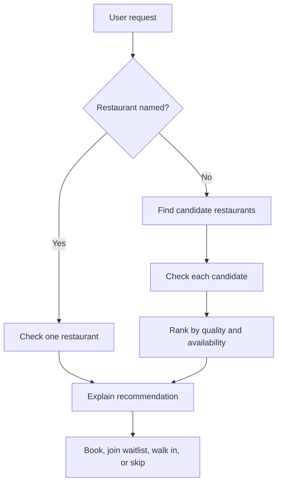
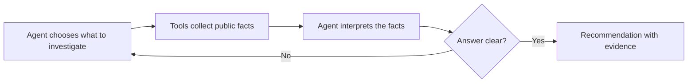
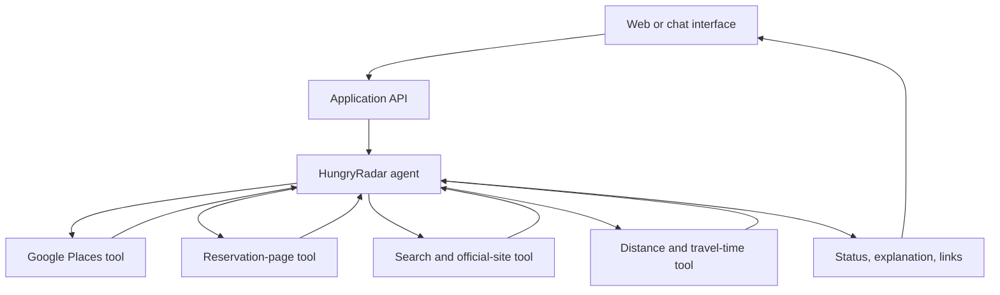
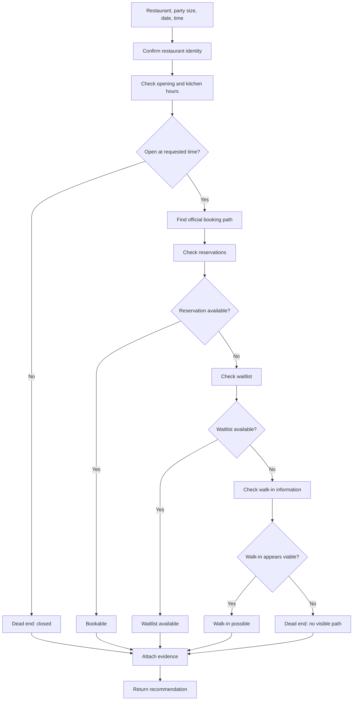

# HungryRadar

> Find me somewhere I can actually eat — not just somewhere that looks good online.

## What this repository does

This repository contains the product concept and proposed architecture for HungryRadar. It is currently a design document, not a runnable application.

## Quick start

Start with the [product and architecture explainer](restaurant-availability-agent.md). It describes the two user workflows, the agent loop, the source boundaries, and the planned AWS implementation.

## Common commands

There are no application commands yet. Once implementation begins, add setup, development, test, and deployment commands here.

## Repository layout

```text
README.md                         Product overview and proposed implementation
restaurant-availability-agent.md  Plain-language system explanation with diagrams
LICENSE                           MIT License
```

HungryRadar is an AI restaurant-availability concierge. It helps hungry people avoid wasted trips by checking whether a restaurant has a reservation, a waitlist, a realistic walk-in option, or no useful path to food at the requested time.

This is not another restaurant directory. It is an investigator that checks several public doors before making a recommendation.

## The problem

Restaurant search answers:

> “Which restaurants look good?”

HungryRadar answers:

> “Can two people actually eat there around 7pm?”

“No reservations” does not always mean “the restaurant is full.” The restaurant may hold tables for walk-ins, have a separate waitlist, release tables later, or have a broken booking page. HungryRadar investigates those possibilities and explains what to do next.

## Two ways to use it

### Check a restaurant

```text
Can two people eat at Nopa tonight around 7:30pm?
Avoid a long wait.
```

HungryRadar checks the restaurant’s hours, booking path, reservation availability, waitlist, walk-in policy, and kitchen hours.

### Find a restaurant

```text
Find highly rated Thai restaurants within 20 minutes.
I need a table for two around 7pm.
```

HungryRadar first finds a short list of candidates, then checks each one for a realistic path to eating there. A highly rated restaurant is not a good recommendation if the user cannot get in.

## What the user gets

Every restaurant receives a practical status:

| Status | Meaning |
| --- | --- |
| **Bookable** | A reservation is visible near the requested time |
| **Waitlist available** | No table is visible, but a waitlist can be joined |
| **Walk-in possible** | Public information suggests going without a reservation may work |
| **Dead end** | There is no visible path to eating there at that time |
| **Unknown** | Sources disagree or the booking page cannot be checked |

The result includes the source links, the time checked, and the next action:

```text
Nopa — tonight at 7:30pm

Reservation: none found
Waitlist: available
Walk-ins: accepted
Kitchen: open until 10:00pm

Recommendation: join the waitlist before leaving.
```

## How the system works



The system uses regular software for repeatable facts and an agent for uncertain decisions.



The agent is the investigator. The tools are its map, phone book, and browser.

## Proposed technical implementation

The implementation is intentionally small and explainable.



### AWS Strands Agents SDK

The agent can be built with the [Strands Agents SDK](https://strandsagents.com/docs/user-guide/quickstart/overview/). Strands provides the agent loop: it lets the model choose a tool, read the result, decide whether it needs another tool, and then produce a final answer.

For a first implementation, Python is a good fit because the Python SDK has broad feature support. TypeScript is also supported if the application team prefers a JavaScript stack.

The agent would have a small set of clearly named tools:

```text
find_places(cuisine, location, rating_floor)
get_place_details(place_id)
find_booking_links(place_id)
check_reservations(booking_url, party_size, date, time)
check_waitlist(booking_url, party_size, date, time)
check_official_updates(restaurant_url)
calculate_travel_time(origin, destination)
```

Each tool should return structured facts, not a paragraph written by another model. For example:

```json
{
  "status": "waitlist_available",
  "source_url": "https://example.com/book",
  "checked_at": "2026-08-22T19:12:00Z",
  "available_times": [],
  "waitlist": {
    "available": true,
    "estimated_wait_minutes": 35
  }
}
```

Strands supports custom tools and MCP tools. For the prototype, small custom tools are simplest. MCP can be added later if we want the same restaurant and booking tools to be shared with other agents. See the [Strands tools documentation](https://strandsagents.com/docs/user-guide/concepts/tools/) and [MCP integration](https://strandsagents.com/docs/user-guide/concepts/tools/mcp-tools/).

### Model and AWS services

The proposed AWS path is:

| Part | Proposed service | Purpose |
| --- | --- | --- |
| Agent framework | Strands Agents SDK | Runs the investigation loop |
| Model | Amazon Bedrock | Interprets the request and decides the next tool call |
| API | AWS Lambda or a small container | Receives requests and runs the agent |
| Public endpoint | API Gateway | Exposes the application to the web UI |
| Short-lived results | DynamoDB or in-memory state | Stores checks, evidence, and timestamps |
| Logs | CloudWatch | Shows tool calls, failures, and agent decisions |

Amazon Bedrock is the default model provider in Strands, but the SDK also supports other model providers. The [Strands Bedrock documentation](https://strandsagents.com/docs/user-guide/concepts/model-providers/amazon-bedrock/) covers credentials and model configuration.

We do not need long-term memory for the first demo. A user request can be handled as one bounded investigation.

## The restaurant-check loop



The loop is bounded. If the answer remains unclear after the agreed sources are checked, the agent returns **Unknown** instead of searching forever or pretending to know.

## Data boundaries

Google Places is useful for restaurant identity, ratings, review counts, location, price level, business status, and opening hours. It is not a guaranteed source of exact occupancy or complete reservation inventory. See the [Google Places API reference](https://developers.google.com/maps/documentation/places/web-service/reference/rest/v1/places).

Reservation information may come from public booking pages or the restaurant’s own site. We should prefer official links and respect access limits. We should not bypass logins, CAPTCHAs, rate limits, or booking protections.

“No reservation found” must not be presented as proof that a restaurant is full. The product should say what it checked, when it checked it, and how confident it is.

## MVP scope

The first demo should include:

- one city;
- one named-restaurant check flow;
- one cuisine-based search flow;
- a small set of public reservation sources;
- direct booking and waitlist links;
- evidence and timestamps;
- no automatic booking.

The ideal demo request is:

```text
I am in San Francisco. Find two highly rated Thai restaurants
within 20 minutes where two people can eat around 7pm tonight.
Do not recommend places with no reservation, no waitlist,
or no credible walk-in path.
```

## Project status

This repository currently documents the product and proposed architecture. The implementation is not yet present.

## License

HungryRadar is released under the MIT License. See [LICENSE](LICENSE).
