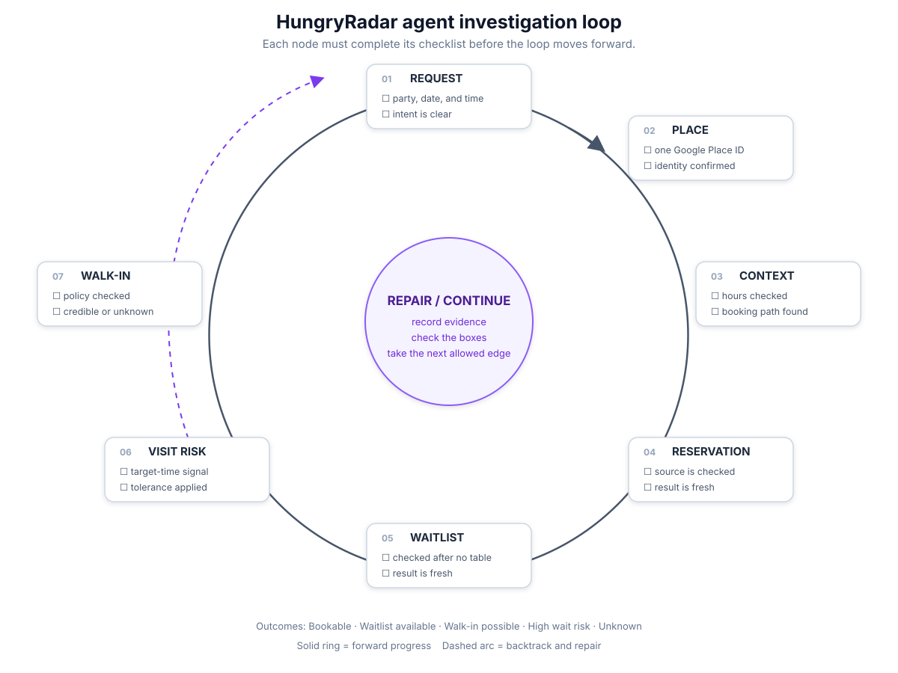

# HungryRadar Investigation Graph

This graph models one agent investigation from request to recommendation. It is not a graph of restaurants or a replacement for Google Places.

## Circular lifecycle diagram



The six numbered nodes are deliberately positioned in a circle. Each node has a small checklist. The center node is the control point: it records evidence, exposes only transitions whose checks are satisfied, and sends the agent backward when a user changes their mind or a later check invalidates an earlier assumption.

## Lifecycle nodes

```text
INPUTS                 Parse and validate the user's request.
IDENTIFY_LISTINGS      Find candidate listings and resolve Google Place IDs.
CHECK_AVAILABILITY     Check reservations, waitlists, hours, and wait risk.
CHECK_RESERVATION_FORM Compare the booking form with our internal data.
PROPOSE_CONFIRM        Show the proposed booking and wait for user confirmation.
BOOK                   Submit the confirmed reservation.
BOOKED                 Terminal success.
WAITLIST_AVAILABLE     Terminal alternative.
NO_MATCH               Terminal no-path result.
UNKNOWN                Terminal uncertainty.
```

## Every edge has a gate

```text
INPUTS -> IDENTIFY_LISTINGS
  requires: valid party size, date, time, and intent

IDENTIFY_LISTINGS -> CHECK_AVAILABILITY
  requires: one or more resolved Google Place IDs

CHECK_AVAILABILITY -> CHECK_RESERVATION_FORM
  requires: a reservation is available and the result is fresh

CHECK_AVAILABILITY -> WAITLIST_AVAILABLE
  requires: no reservation and a waitlist is available

CHECK_AVAILABILITY -> NO_MATCH
  requires: no reservation and no waitlist or credible path

CHECK_RESERVATION_FORM -> PROPOSE_CONFIRM
  requires: form fields match the internal reservation data structure

PROPOSE_CONFIRM -> BOOK
  requires: proposal shown and user confirmed

BOOK -> BOOKED
  requires: booking submitted successfully

PROPOSE_CONFIRM -> IDENTIFY_LISTINGS
  requires: user declined and wants another option

BOOK -> PROPOSE_CONFIRM
  requires: booking failed and another attempt is allowed
```

## Backpedaling rules

Backpedaling is normal. It is how the agent repairs a weak investigation instead of hallucinating a conclusion.

```text
ambiguous listing            -> IDENTIFY_LISTINGS
hours or availability stale  -> CHECK_AVAILABILITY
form mismatch                -> CHECK_RESERVATION_FORM
user declines proposal      -> IDENTIFY_LISTINGS
booking fails                -> PROPOSE_CONFIRM
missing terminal evidence   -> earliest node that can produce it
```

Every loop node stores:

```text
state
entered_at
attempt_count
required_evidence
collected_evidence
next_allowed_steps
backtrack_target
```

The runner must cap attempts and keep a checkpoint after each successful transition. A checkpoint makes the loop inspectable, resumable, and easy to explain to the user.

## Pseudocode

```python
while not graph.is_terminal():
    step = graph.current_step()
    allowed = graph.allowed_transitions(step, evidence)

    if not allowed:
        graph.backtrack_to_repairable_step()
        continue

    tool = strands.choose_tool(allowed)
    facts = tool.run(request, graph.context)
    graph.record(facts)

    if graph.gates_passed():
        graph.advance()
    else:
        graph.backtrack_or_mark_unknown()
```

Strands chooses among allowed investigations. It does not get to skip a gate, promote an unverified fact, or invent a missing wait estimate.
