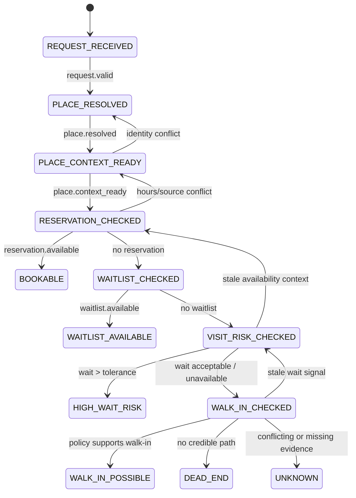

# HungryRadar Investigation Graph

This graph models one agent investigation from request to recommendation. It is not a graph of restaurants or a replacement for Google Places.

## Lifecycle diagram



## Lifecycle nodes

```text
REQUEST_RECEIVED       Parse and validate the user's party, date, time, and intent.
PLACE_RESOLVED         Select exactly one Google Place ID.
PLACE_CONTEXT_READY    Load canonical place data and requested-time hours.
RESERVATION_CHECKED    Obtain a fresh reservation result.
WAITLIST_CHECKED       Obtain a fresh waitlist result after no reservation.
VISIT_RISK_CHECKED     Check target-time Google visit/wait data after no reservation.
WALK_IN_CHECKED        Check official walk-in policy and service constraints.
BOOKABLE               Terminal success.
WAITLIST_AVAILABLE     Terminal success.
WALK_IN_POSSIBLE       Terminal, qualified success.
HIGH_WAIT_RISK         Terminal exclusion.
DEAD_END               Terminal exclusion.
UNKNOWN                Terminal uncertainty.
```

## Every edge has a gate

```text
REQUEST_RECEIVED -> PLACE_RESOLVED
  requires: valid party size, date, time, and restaurant intent

PLACE_RESOLVED -> PLACE_CONTEXT_READY
  requires: one Google Place ID and a canonical Place snapshot

PLACE_CONTEXT_READY -> RESERVATION_CHECKED
  requires: requested-time opening status and a booking path or explicit absence

RESERVATION_CHECKED -> BOOKABLE
  requires: reservation.available == true

RESERVATION_CHECKED -> WAITLIST_CHECKED
  requires: reservation.checked_at is fresh and available == false

WAITLIST_CHECKED -> VISIT_RISK_CHECKED
  requires: waitlist checked and no reservation

VISIT_RISK_CHECKED -> HIGH_WAIT_RISK
  requires: target-time wait estimate > user tolerance

VISIT_RISK_CHECKED -> WALK_IN_CHECKED
  requires: target-time wait is acceptable, or Google explicitly has no estimate

WALK_IN_CHECKED -> WALK_IN_POSSIBLE
  requires: credible walk-in policy evidence
```

## Backpedaling rules

Backpedaling is normal. It is how the agent repairs a weak investigation instead of hallucinating a conclusion.

```text
ambiguous place              -> PLACE_RESOLVED
hours conflict               -> PLACE_CONTEXT_READY
stale reservation result     -> RESERVATION_CHECKED
booking source blocked       -> RESERVATION_CHECKED, alternate source
missing visit estimate       -> VISIT_RISK_CHECKED, record unavailable
conflicting walk-in sources  -> WALK_IN_CHECKED
missing terminal evidence    -> earliest node that can produce it
```

Every node stores:

```text
state
entered_at
attempt_count
required_evidence
collected_evidence
next_allowed_steps
backtrack_target
```

The runner must cap attempts and keep a checkpoint after each successful transition. A checkpoint makes the loop inspectable, resumable, and easy to explain to the user.

## Pseudocode

```python
while not graph.is_terminal():
    step = graph.current_step()
    allowed = graph.allowed_transitions(step, evidence)

    if not allowed:
        graph.backtrack_to_repairable_step()
        continue

    tool = strands.choose_tool(allowed)
    facts = tool.run(request, graph.context)
    graph.record(facts)

    if graph.gates_passed():
        graph.advance()
    else:
        graph.backtrack_or_mark_unknown()
```

Strands chooses among allowed investigations. It does not get to skip a gate, promote an unverified fact, or invent a missing wait estimate.
