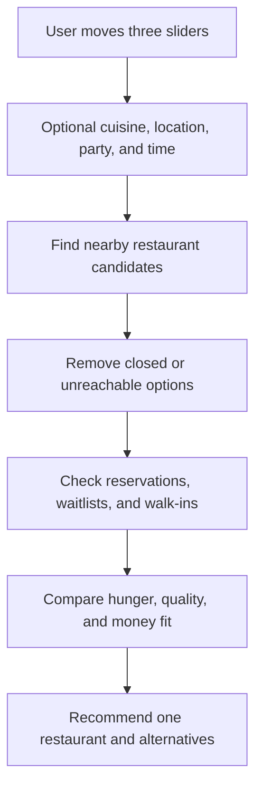

# Beta Feature: Hungry, Quality, Money

## What this feature does

HungryRadar asks the user three simple questions:

1. How hungry are you right now?
2. How much do you care about restaurant quality today?
3. How much money do you want to spend?

The user moves three sliders, and HungryRadar recommends a restaurant that fits the mood—not just the highest-rated restaurant nearby.

The feature is meant to feel like telling a friend:

> “I need food now, I want somewhere decent, but I do not want to spend much.”

## The user experience

The user sees one simple screen:

```text
How hungry are you?
Not urgent       Need food now
       1   2   3   4   5

How much do you care about quality today?
Quick and casual       Make it special
       1   2   3   4   5

How much do you want to spend?
Save money       Happy to splurge
       1   2   3   4   5

[Find me a restaurant]
```

These are preference sliders, not a long form. The user can optionally add a cuisine, location, party size, or time, but the three scales are the heart of the beta feature.

## What the scales mean

### Hungriness

This measures urgency, not how much food the user can physically eat.

| Score | Meaning |
| --- | --- |
| 1 | I am browsing and can wait |
| 2 | I would like food soon |
| 3 | I want to eat within the next hour |
| 4 | I am hungry and do not want much friction |
| 5 | I need food now |

A high hungriness score makes HungryRadar prioritize restaurants that are open, nearby, bookable, or likely to seat walk-ins quickly.

### Quality

This measures how much the user wants the meal to feel worth it.

| Score | Meaning |
| --- | --- |
| 1 | Quick and casual is fine |
| 2 | I want something solid |
| 3 | I want a good meal |
| 4 | I want somewhere noticeably good |
| 5 | I want a special or memorable meal |

A high quality score makes HungryRadar prioritize strong ratings, review volume, restaurant reputation, and fit for the occasion.

### Money

This measures willingness to spend, not the restaurant’s objective price.

| Score | Meaning |
| --- | --- |
| 1 | Keep it as cheap as possible |
| 2 | Good value matters |
| 3 | Normal spending is fine |
| 4 | I can spend more for a better option |
| 5 | I am happy to splurge |

A low money score makes HungryRadar prioritize lower price levels, value, and available deals. A high money score allows more expensive restaurants when the quality and availability justify it.

## How the recommendation works

The three sliders are not the final answer by themselves. HungryRadar combines them with restaurant facts and live availability.



Hungriness controls urgency. Quality controls how much restaurant quality matters. Money controls how much price matters. Availability is always a hard reality check.

For example:

```text
Hungriness: 5
Quality: 2
Money: 1
```

Recommendation style:

> “Go to the nearby, inexpensive place with a table available now. Do not wait 45 minutes for the highest-rated restaurant.”

```text
Hungriness: 2
Quality: 5
Money: 5
```

Recommendation style:

> “You have time to wait for the stronger experience. I found a highly rated restaurant with a table later tonight.”

## The result card

The user should receive one primary recommendation and a small number of alternatives.

```text
Recommended for you

Curry House
Indian · 4.6 stars · $ · 8 minutes away

Why this fits:
Open now, inexpensive, and a table is available soon.

[Reserve for 2 at 7:40pm]
[View menu] [Website] [Open in Maps]
```

Alternative cards can show a clear tradeoff:

```text
Higher quality, longer wait

Spice Route
Indian · 4.8 stars · $$$ · 18 minutes away

No table at 7:40pm. Waitlist is available.

[Join waitlist] [View menu]
```

Do not show an internal score breakdown or a confidence label to the user. Explain the recommendation in ordinary language.

## What the agent does

The three slider values are simple inputs. The agent is useful because it turns them into a plan and explains the tradeoff.

```mermaid
sequenceDiagram
    participant User
    participant Agent
    participant Places as Google Places
    participant Booking as Booking sources

    User->>Agent: Hungry 5, quality 2, money 1
    Agent->>Places: Find nearby low-cost candidates
    Places-->>Agent: Candidate restaurants and metadata
    Agent->>Booking: Check the most practical candidates
    Booking-->>Agent: One table available soon; others have long waits
    Agent-->>User: Recommend the available low-cost option
```

The agent should use the same restaurant-check flow described in [restaurant-availability-agent.md](restaurant-availability-agent.md). The scales change how restaurants are prioritized; they do not change the basic rules for checking whether a restaurant is actually reachable.

## Simple beta data

The beta only needs to save the three submitted values with the search request:

```text
hungriness: 1 to 5
quality: 1 to 5
money: 1 to 5
```

The request can also include the existing search information:

```text
location
cuisine
party size
date and time
seating preference, if provided
allergies, if provided
```

The three scales should not be permanent user preferences by default. They describe how the user feels for this meal. John might be very hungry and price-sensitive today, but want a special expensive dinner tomorrow.

## Beta rules

- Ask only three scale questions before showing results.
- Let the user adjust the scales and run the recommendation again.
- Always prioritize restaurants that are actually open and reachable.
- Never treat a high rating as a substitute for availability.
- Never make the user infer why a restaurant was recommended.
- Show one clear recommendation before showing alternatives.
- Keep the existing reserve, waitlist, menu, website, and Maps actions.
- If no restaurant fits all three scales, explain the tradeoff and offer the closest options.

## What success looks like

The feature succeeds if the user can answer:

> “Why did HungryRadar choose this place for me?”

with a simple response:

> “Because you are very hungry, want to spend less, and do not need a special occasion meal. It is nearby and has a table available now.”
