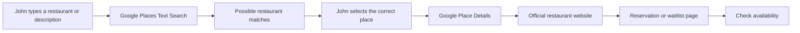
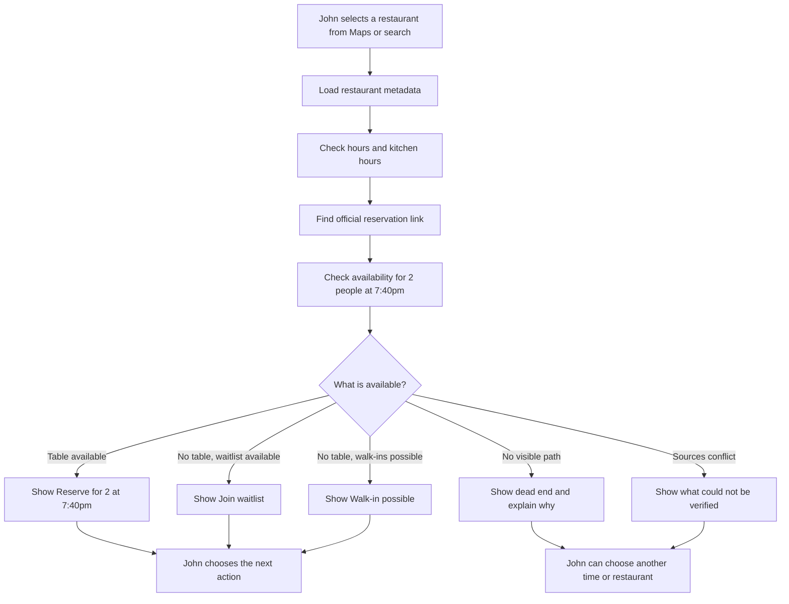
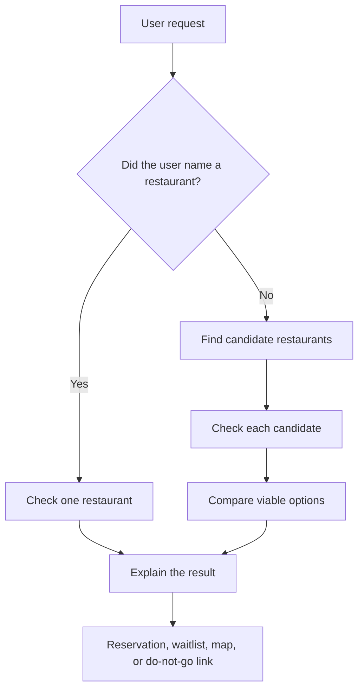
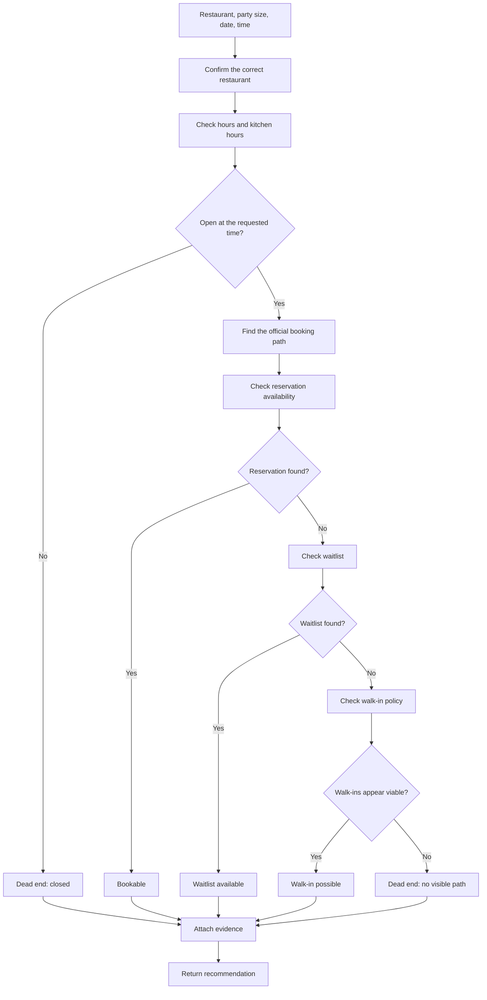
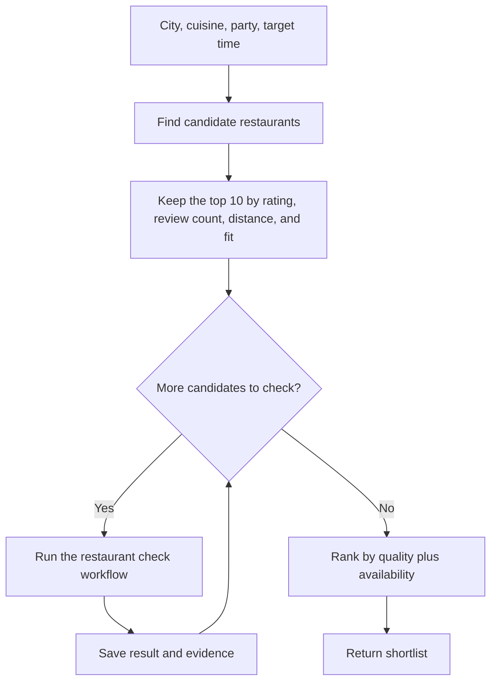
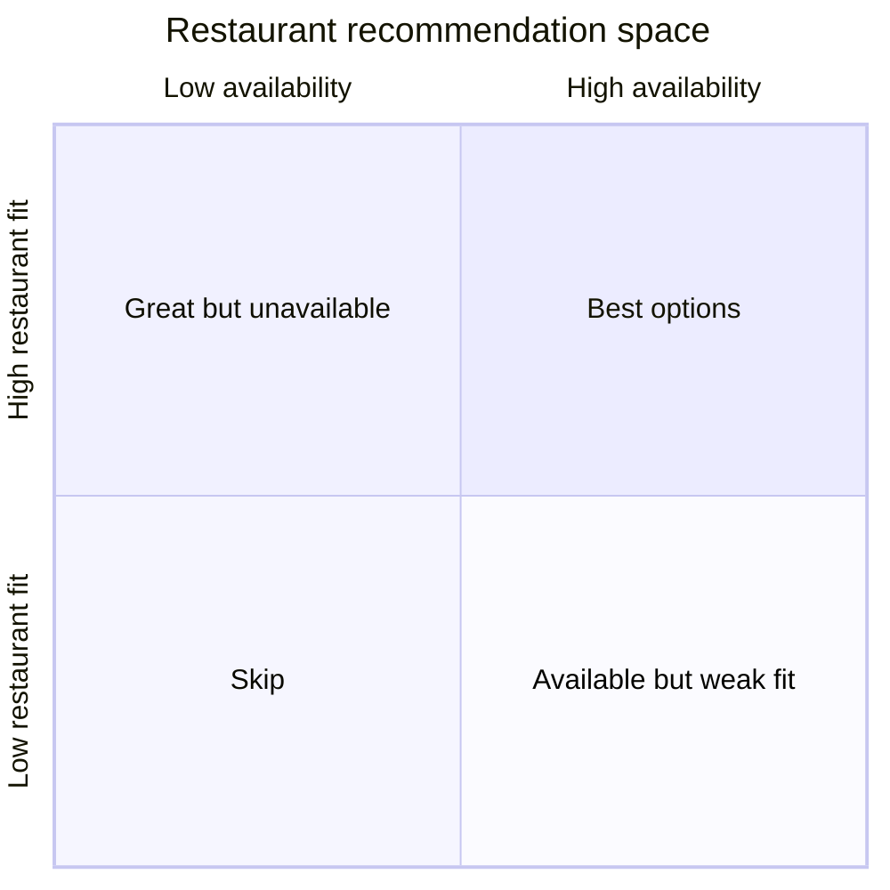
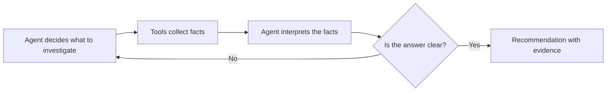

# Restaurant Availability Agent

## Purpose

This document explains the restaurant availability idea for the product and engineering team.

The product answers a practical question:

> **Can I realistically eat at this restaurant soon, or am I about to waste a trip?**

This is not a restaurant directory and it does not claim to know the exact number of people inside a restaurant. It investigates the public signals that tell us whether there is a realistic path to getting food:

- a reservation is available;
- a waitlist is available;
- walk-ins are accepted;
- the restaurant is open and still serving food; or
- the restaurant is effectively a dead end for the requested time.

The agent is like a friend who checks several doors before telling you whether it is worth driving across town.

## End-to-end user flow

This is the product experience from signup through reservation.

### Step 1: John creates an account

John opens HungryRadar and signs up:

```text
First name: John
Last name: Smith
Phone number: 415-555-0198
Email: john@example.com
```

We save this contact information in the user database so it can be reused when John makes a reservation. We do not ask for seating preferences, allergies, or special requests during signup. Those are collected later only when they matter for a specific search.

### Step 2: John asks for a restaurant

John says:

```text
Find me a good Italian restaurant near me tonight around 7:40pm for two people.
```

The agent finds restaurants, checks their availability, and returns restaurant cards. Each card includes links to the menu, website, map, and the next useful action.

```text
Trattoria Roma
Italian · 4.7 stars · 12 minutes away

7:40pm: Available

[Reserve for 2 at 7:40pm] [View menu] [Website]
```

```text
Pasta House
Italian · 4.8 stars · 8 minutes away

7:40pm: Not available
Waitlist: Available

[Join waitlist] [View menu] [Website]
```

### Step 3: John chooses the quick action

John taps **Reserve for 2 at 7:40pm** on Trattoria Roma.

HungryRadar uses:

```text
John Smith
415-555-0198
john@example.com
2 people
Tonight at 7:40pm
```

The app checks the exact time again before booking. The quick action does not silently move John to another time or restaurant.

### Step 4: The reservation is confirmed

If the table is still available, HungryRadar completes the reservation and shows:

```text
Reservation confirmed

Trattoria Roma
Tonight at 7:40pm
2 people

Confirmation sent to john@example.com
```

If the table disappeared, HungryRadar does not make a different reservation automatically:

```text
The 7:40pm table is no longer available.
No reservation was made.

You can try another time or join the waitlist.
```

John can change the party size, seating preference, allergies, or special requests for a later search without changing the contact information saved to his account.

### The “I have a restaurant” flow

John may already know where he wants to eat. He types a restaurant name, a neighborhood, or a description such as “that sushi place near Mission.”

Google Places powers this search and helps us turn the fuzzy input into the correct restaurant. We should not guess from the name alone. Google Places returns possible matches, and John selects the right location when there is more than one.



Google Places answers **which restaurant is this?** The official restaurant website or booking provider answers **can John eat there at his requested time?**

```text
Restaurant: Trattoria Roma
Party: 2 people
Time: tonight at 7:40pm
```

When John selects the restaurant, HungryRadar carries over the restaurant information it already has:

```text
Restaurant name
Address
Google Maps link
Rating and review count
Price level
Phone number
Website
Menu link, when available
Opening hours
Coordinates and travel distance
```

The agent then checks the restaurant itself instead of searching for other restaurants:



The restaurant card should preserve the useful information from the original search while adding the live availability result:

```text
Trattoria Roma
Italian · 4.7 stars · $$$
12 minutes away

Open until 10:00pm
7:40pm: Available for 2 people

[Reserve for 2 at 7:40pm]
[View menu] [Website] [Open in Maps]
```

If John selected the restaurant from an external Google Maps search, he can provide the restaurant name, link, or place result. HungryRadar uses that information to identify the correct location before checking availability. If there are multiple restaurants with the same name, the app should show the address and ask John to choose the right one rather than guessing.

## The two user workflows

### Workflow 1: Check one restaurant

The user already knows where they want to go.

```text
Restaurant: Nopa
People: 2
Target: tonight at 7:30pm
```

The agent investigates that restaurant and returns a clear recommendation.

Example result:

```text
Nopa — tonight at 7:30pm

Reservation: none found
Waitlist: available
Walk-ins: accepted
Kitchen: open until 10:00pm

Recommendation: join the waitlist before leaving.
```

### Workflow 2: Find a restaurant

The user gives us a broader request.

```text
Find the best-rated Thai restaurants within 20 minutes.
I want a table for two around 7:00pm.
```

This workflow has two stages:

1. Find a short list of good candidates.
2. Check each candidate for a realistic path to eating there.

The important difference from a normal restaurant search is that a high-rated restaurant is not automatically a good recommendation if there is no reservation, no waitlist, and no reasonable walk-in option.

## What the agent should return

Every restaurant should end in one of a small number of understandable states:

| Status | Meaning | Recommended action |
| --- | --- | --- |
| **Bookable** | A reservation is visible near the requested time | Book it |
| **Waitlist available** | No table is visible, but the restaurant accepts waitlist entries | Join the waitlist |
| **Walk-in possible** | No reservation is visible, but public information says walk-ins are accepted | Go only if nearby or willing to wait |
| **Dead end** | Closed, no reservation path, no waitlist, and no viable walk-in path | Do not waste the trip |
| **Unknown** | Sources disagree or the booking system cannot be checked | Verify manually |

The agent should always show:

- what it checked;
- when it checked it;
- the source link;
- the recommendation.

## High-level system picture



The candidate search and the restaurant check are separate jobs. This keeps the system easy to reason about and lets us improve one without rewriting the other.

## Workflow 1: Checking one restaurant



### How the loop behaves

The agent should not search forever. It follows a short investigation path and stops when the answer is clear.

```mermaid
sequenceDiagram
    participant User
    participant Agent
    participant Places as Place data
    participant Booking as Booking pages
    participant Official as Restaurant site

    User->>Agent: Can two people eat here at 7:30?
    Agent->>Places: Check identity, hours, rating, address
    Places-->>Agent: Restaurant is open
    Agent->>Booking: Check reservation availability
    Booking-->>Agent: No reservation found
    Agent->>Booking: Check waitlist
    Booking-->>Agent: Waitlist unavailable
    Agent->>Official: Check walk-in and kitchen information
    Official-->>Agent: Walk-ins accepted; kitchen open
    Agent-->>User: Walk-in possible
```

The agent is not trying to prove that the restaurant is busy. It is trying to find the next useful action.

## Workflow 2: Finding a restaurant



The agent should not simply return the ten highest-rated places. It should rank restaurants by a combination of quality and actual feasibility.

### Example ranking logic

```text
Recommendation value
  = restaurant quality
  + match to requested time
  + distance fit
  + price fit
  - wait risk
  - source conflict
```

This does not need to be a perfect mathematical model for the MVP. The important thing is that the user can understand why a lower-rated restaurant may be recommended over a higher-rated one:

> “The 4.8-star restaurant is a dead end tonight. This 4.5-star restaurant has a confirmed table eight minutes away.”

## Simple decision chart



The best result is not always the highest-rated restaurant. It is the best combination of fit and a realistic path to eating there.

## What each source is used for

We should use sources for the jobs they are good at instead of asking one source to answer everything.

| Source or tool | What we use it for | What it cannot prove |
| --- | --- | --- |
| Google Places | Restaurant identity, rating, review count, location, price level, hours, business status | Exact current occupancy or complete reservation inventory |
| Restaurant website | Official hours, kitchen hours, walk-in rules, closure notices, booking links | Guaranteed availability unless it exposes a live booking page |
| Reservation platform | Visible reservations, waitlists, party-size and time options | That no visible table means the restaurant is completely full |
| Search | Discovering the official site, booking page, and recent public updates | A reliable real-time source of truth by itself |
| Maps or travel service | Distance and estimated travel time | Whether the user will actually get seated |

The official Google Places API provides fields such as rating, review count, price level, business status, and opening hours. Its documented place fields should be treated as the supported contract; “popular times” is not a core availability field we should depend on. See [Google Places resource fields](https://developers.google.com/maps/documentation/places/web-service/reference/rest/v1/places).

## Agent versus regular software

The regular software should handle repeatable facts:

- find place details;
- calculate distance;
- parse opening hours;
- check a booking page;
- collect available time slots;
- record source links and timestamps.

The agent should handle the uncertain parts:

- decide which source to check next;
- recognize that two pages refer to the same restaurant;
- interpret “walk-ins accepted” or “bar seating only”;
- reconcile conflicting hours;
- decide whether a result is a dead end;
- explain the tradeoff in plain language.



The agent is the investigator. The tools are its phone book, map, and browser.

## Minimal shared state

The system only needs a small record while checking a restaurant:

```text
restaurant
party size
requested date and time
location and travel limit
reservation link
available reservation times
waitlist status
walk-in information
opening and kitchen hours
source links
last checked time
status
```

This state lets the agent pause, revisit a source, or explain exactly how it reached its conclusion.

## Failure and uncertainty rules

The agent must not overstate what it knows.

### “No reservation” is not the same as “full”

A restaurant may:

- reserve only part of its tables online;
- hold tables for walk-ins;
- release tables later;
- use a separate waitlist;
- have a booking page that is temporarily broken.

The correct output may be:

> “No reservation is visible. Walk-ins are reportedly accepted, but current wait time could not be verified.”

### Source conflicts

If Google says the restaurant is open but the official site says it is closed for a private event, the agent should show the conflict and prefer the more specific, more recent official notice.

### Missing data

If a source cannot be checked because it requires login, blocks automated access, or exposes no public availability, the result should be **Unknown**, not **Dead end**.

## MVP scope

For the first version, keep the system deliberately small:

- one city;
- one cuisine-focused search flow;
- one named-restaurant check flow;
- a small number of reservation sources;
- no automatic booking;
- no claim of exact occupancy;
- direct links for the user to finish the reservation.

The best demo request is:

```text
I am in San Francisco. Find two highly rated Thai restaurants
within 20 minutes where two people can eat around 7pm tonight.
Do not recommend places with no reservation, no waitlist,
or no credible walk-in path.
```

The demo should visibly show the agent checking different paths and rejecting dead ends.

## Product promise

The product promise is simple:

> **Find me somewhere I can actually eat, not just somewhere that looks good online.**

That is the reason to use an agent. The value is not collecting restaurant records. The value is investigating a changing, ambiguous situation and helping the user avoid a wasted trip.
